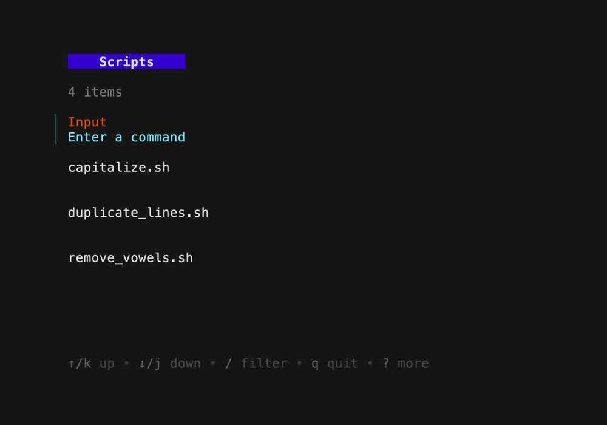
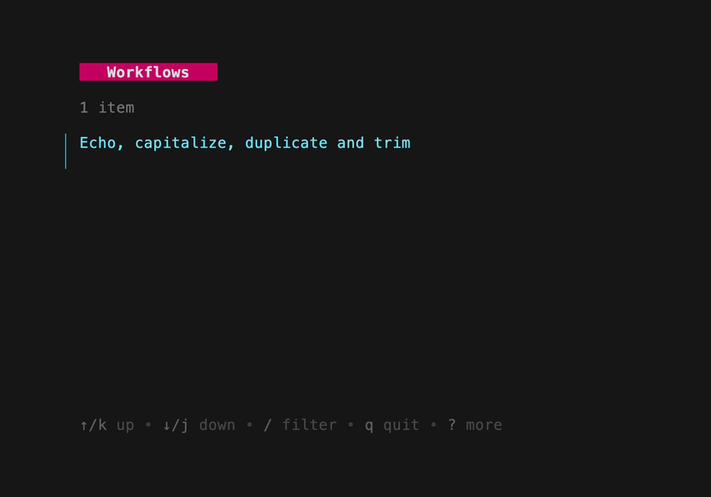

# Launcher
A script launch pad, written in Go! 
<p float="middle">
    
    
    
</p>

## Description
A homepage TUI and runner for your scripts, build complex workflows with ease!

Launcher allows you to run scripts and commands on your machine or join them together to make chains!

These chains can be thought of as workflows, and can be saved and loaded for easy access.

```
Within the code and config `chains` and `workflows` are used interchangeably. 
But a workflow is probably something you would want to save and load for reuse and sharing.
```

---
This idea came to me when I realised that most of the scripts or commands I use are POSIX compliant

We can think of these like modules or functions in a system, pieces of code that can be combined in many different and useful ways.

Having a nice interface would take away some of the mental overhead of needing to work with long command chains of scripts 

Sure you can add them to a config, but making quick changes and edits to these can often be unnecessary overhead when wanting to get stuff done

The launcher is always there to build up some of these for saving and reuse 

Building it seemed like a fun challenge too!

---

### Main Go dependencies:
- [Bubble Tea](https://github.com/charmbracelet/bubbletea) for the terminal user interface (TUI)
- [Cobra](https://github.com/spf13/cobra-cli) and [Viper](https://github.com/spf13/viper) for command line parsing and configuration management

## Features
- Run scripts and commands, or start a chain of scripts to run
    - Optionally add arguments to scripts for when they run
- Create, save, edit and run chains of scripts, creating a workflow
- View and edit the output of a script or chain, before passing it to the next script
    - You could also save them to file, anything you can do in your editor really
- Pipe command outputs into the launcher for further use -- e.g. `echo hello | launcher`
- Edit the script and workflow files in your $EDITOR of choice from within the launcher
    - You might also need to set $VISUAL to your editor of choice


### Workflows:


These are the core concept of the launcher, they are saved as `json` files in the `launcher_dir/custom` directory.

These can be loaded and run as a chain, or run individually.

The chain is run sequentially, with the output of each script being passed to the next.

>This allows you to build up complex workflows, and save them for easy reuse.


#### Contribute a workflow!
Got a workflow you think is pretty neat or does something cool?

Check [contributing](CONTRIBUTING.md) to get it added to the community submissions!

>Or just print it out and staple it to your wall, you should be proud of that one!

## Requirements
- A terminal
- Go 1.23 or higher

    > Might work with older versions but I've not tested that.
- vipe, for viewing and editing the stdout of scripts in your `$EDITOR` 
    >I thought about making this part myself, but this does the job so well already

## Installation
To install launcher, use the following command:
```sh
go install github.com/Doctor-Scott/launcher@latest
```

Or clone the repository and build it yourself:
```sh
git clone https://github.com/Doctor-Scott/launcher.git
cd launcher
go build -o launcher
./launcher
```

## Usage
### The TUI
The entry point for the launcher is the `launcher` command. (who would have guessed)

This will open the main interface

This has 2 views, scripts and workflows, use the `tab` key to switch between them

#### Scripts View

Run scripts within the script path, the default path for these scripts can be found in the config
> currently does not work with nested directories

You can also select the `Input` box, and enter a command to run or chain

You can view and edit the underlying file for a script in the list with the `open_item_under_cursor` keybind

---
<details>
    <summary>Scripts example (click to expand)</summary>

</details>

---

#### Chaining the scripts
Chain scripts together to create workflows

---
<details>
    <summary>Chain example (click to expand)</summary>

</details>

---
#### Workflows View
A list of saved workflows, these can be added to the chain, or run individually

You can view and edit the underlying `json` for a workflow with the `open_item_under_cursor` keybind

---
<details>
    <summary>Workflow example (click to expand)</summary>

</details>

---

### The Commands
>For a full list of commands, run `launcher --help`

#### Arguments
Launcher has a number (1 is still a number) of optional args that can be used to interact with the tool.

E.g. List scripts in the script path:
```sh
launcher list
```
>I want to add more, like running a workflow as a command!

#### Flags
Use `launcher -p <path>` to change the path the launcher uses for scripts

Useful when you have multiple directories with scripts
> These should still all work when added to workflows, as the launcher will resolve the full path to the script

## Examples
<details>
    <summary>Scripts</summary>

</details>

---
<details>
    <summary>Chains</summary>

</details>

---
<details>
    <summary>Workflows</summary>

</details>

---

## Configuration

You can configure the launcher by creating a `launcher.toml` file in your .config directory in your $HOME path.

Or if there is a `launcher.toml` file in the current directory, it will be used instead.

This can be changed with the `LAUNCHER_CONFIG_PATH` environment variable.

### Default configuration
```toml
autosave = true                      # automatically save the current chain
clear_chain_after_run = false

[colors]
chain_title = '#c60062'
cursor = '#6fe6fc'
input_title = '#e64d00'
script_title = '#3300cc'
selected_script = '#6fe600'

[keybindings]
clear_state = 'c'
debug = 'd'
refresh_view = 'r'
write_config = 'U'

[keybindings.chain]
# workflow view specific keybindings
load_known = 'L'
load_under_cursor = 'l'
run_chain = 'R'
write = 'W'

[keybindings.edit]
open_config = 'C'
open_item_under_cursor = 'e'
open_editor = 'n'
open_stdout = 'v'

[keybindings.item]
# add or run either a script or a workflow
add_to_chain = 'a'
run_under_cursor = 'enter'

[keybindings.script]
# script view specific keybindings
add_args_and_run = 'space'
add_args_then_add_to_chain = 'A'
remove_from_chain = 's'

[paths]
# change these to have the launcher default to your own paths
launcher_dir = '$HOME/.launcher/'
script_dir = '$HOME/.scripts/launcherScripts/'

[selected_script_description] 
# edit how you want to show the position of the selected script in the chain
# e.g "Position: 1, 2, 3 of 3"
chain_separator = ', '
chain_total_separator = ' of '
prefix = 'Position: '
use_and_in_description = false
```


## Contributing
Check [contributing](CONTRIBUTING.md) for more details

## TODOs
- Add more commands, like running a workflow as a command!
- Allow viewing community workflows in the TUI with a command
- Add more documentation
    - Including some more examples, screenshots and gifs

## License

This project is licensed under the [MIT License](LICENSE) - see the LICENSE file for details.

## Contact
Always up for a chat!

`felixpowerbusiness@gmail.com`
